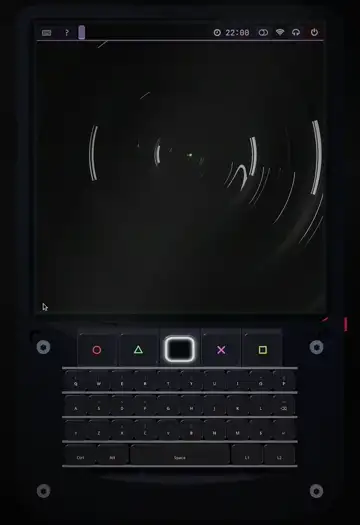

# swaymp — Music Player for the Hackberry Pi

Turns a Hackberry Pi (CM5 handheld) into a dedicated music player: MPD +
Euphonica for playback, sway + waybar on a HyperPixel4 panel, PipeWire audio,
Snapcast multiroom.

Mostly portable beyond the Hackberry — only the display setup, keyboard
keybinds, and 720×720 panel tuning are hardware-specific.

**Live site:** https://fayaaz.github.io/swaymp

[](https://github.com/fayaaz/swaymp/blob/main/demo/embed.mp4)
*The real Pi screen playing as the 3D keyboard's display — each shortcut
lights the key that fires it.* · [full video (1:33)](https://github.com/fayaaz/swaymp/blob/main/demo/embed.mp4)

## What's inside

- MPD + MPC keybinds (play/pause, next/previous, ±5s seek, volume + mute)
- Euphonica + myMPD clients, fuzzel launcher, F13 cheatsheet
- Snapcast Receiver / Broadcast / Group via `Super+X`, snapweb phone UI
- sway + waybar + Dracula theme, bluetuith / wifitui TUIs, Syncthing folders

## How to

`setup-pi.sh` installs and configures the whole sway stack, but it does
**not** log you in — after a reboot you'll still land on the stock desktop.
To boot straight into sway, enable LightDM autologin:

```ini
# /etc/lightdm/lightdm.conf
[Seat:*]
user-session=sway
autologin-user=pi
autologin-session=sway
```

then reboot (use your username instead of `pi`). Without this, start sway
from a TTY or pick the sway session in your greeter.

## Credits

Wallpaper: Pat Hayden ([Unsplash](https://unsplash.com/photos/a-black-and-white-photo-of-a-circular-object-biaGCdzlDAk)) ·
Body shells: ZitaoTech ([MIT](https://github.com/ZitaoTech/HackberryPiCM5)) ·
Demo track: ENOENT — *Hopscotch*
